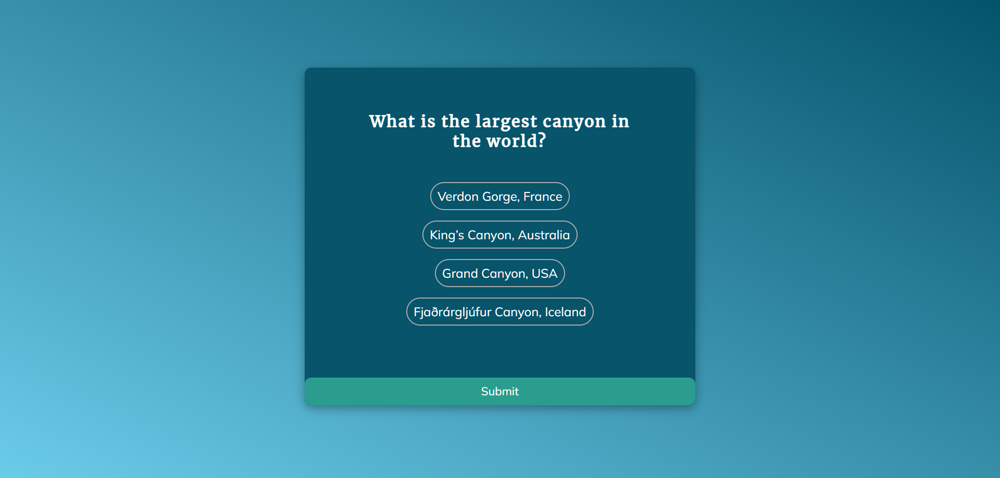
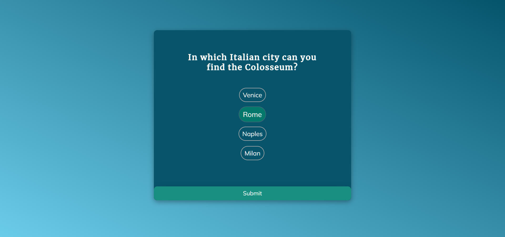
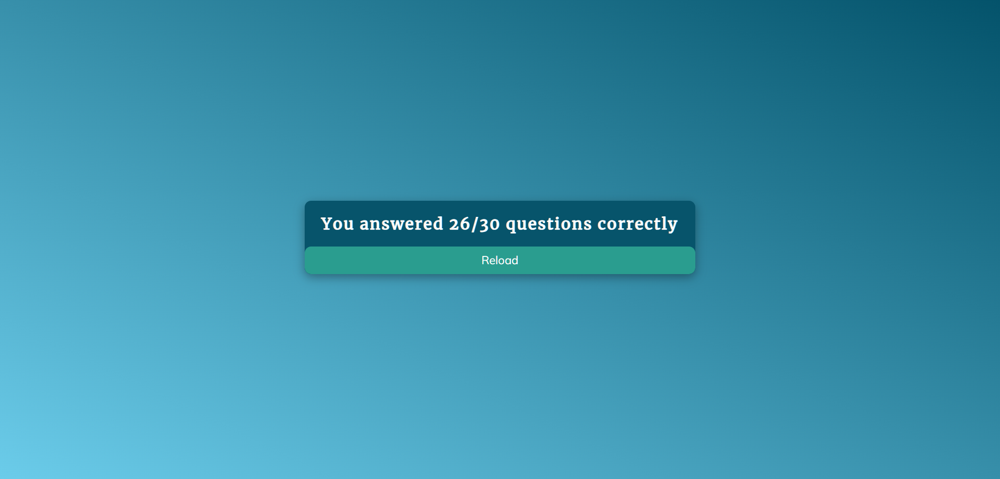

# Quiz

#### Description:

This Project is a quiz game with multiple choice questions covering a variety of subjects. It has a set of questions with four possible answers.It also tracks the player's progress and shows them how many questions they have answered correctly.

#### Features:

- Multiple choice questions covering a variety of subjects.
- Click the submit button to get result.
- Green color is displayed for each correct selection and red color for wrong.

  
  
- Progress tracking
- Reload button to play again.

  

#### How to play:

- Read the question and choose the answer you think is correct.
- Number of correctly answered questions will be displayed at the end of the quiz.
- Click the reload button if you want to play again.

## Demo

Watch the demo video on [YouTube](https://youtu.be/-UL_EBLghO0).

## Tech Stack

**Front End :** HTML, CSS, JavaScript

**IDE:** Visual Studio Code

#### Visit Website: https://quiz-app-kvs.netlify.app/

